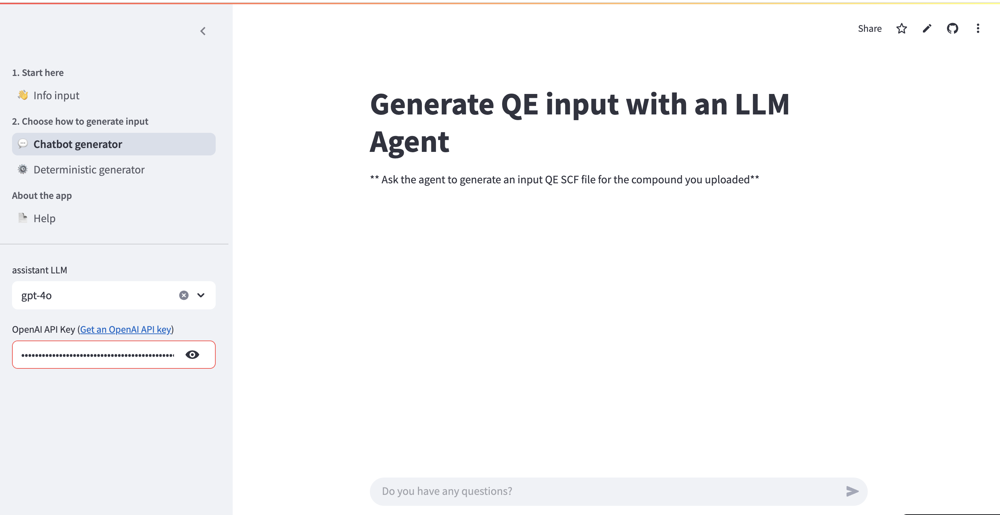

ALternatively the input file can be generated with a LLM. The choice of the models is availible. To use the model you need to be registered with corresponding inference provider (OpenAI, Gemini, or Groq). Also, OpenAI models require payment. The chat input appears when the key is specified.

To generate input, just ask the agent (LLM) to generate an input file. To ensure correctness of the generation, under the hood the combination of prompting and tools is used to generate an input file.

