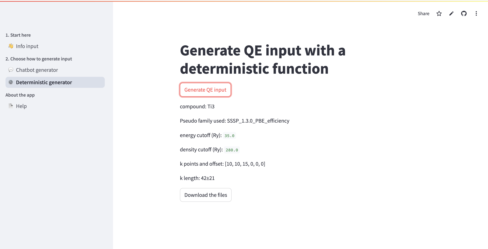

## Deterministic Generator

The deterministic generator uses functions from the [ASE](https://wiki.fysik.dtu.dk/ase/) package to generate Quantum Espresso input files. This method is reproducible and does not require any API keys.

### Usage

The page for generating input using the deterministic function is shown below.

1. Ensure you have provided all required information on the [Data Input page](intro.md)
2. Click the "Generate Input" button
3. Review the generated parameters displayed on the page
4. Download the `.zip` archive containing:
   - `qe.in`: The Quantum Espresso input file
   - `structure.cif`: The structure file used
   - Pseudopotential files (`.UPF` or `.upf`): All required pseudopotential files for the compound

### Output

After pressing the generation button, information about the used parameters is displayed. The user is prompted to download a `.zip` archive which contains the input file, the structure file, and pseudopotential files.

### Generated Parameters

The deterministic generator uses:
- Maximum cutoffs from SSSP tables for all elements in the compound
- Predicted k-point mesh from the selected ML model (RF or ALIGNN)
- Constant smearing: 0.01 Ry Marzari-Vanderbilt
- Selected functional and pseudopotential mode

The generated input file is ready to use with Quantum Espresso.