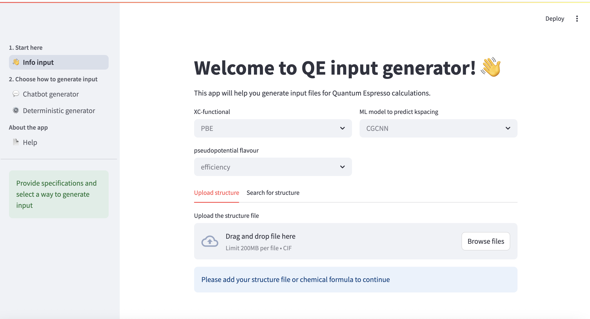
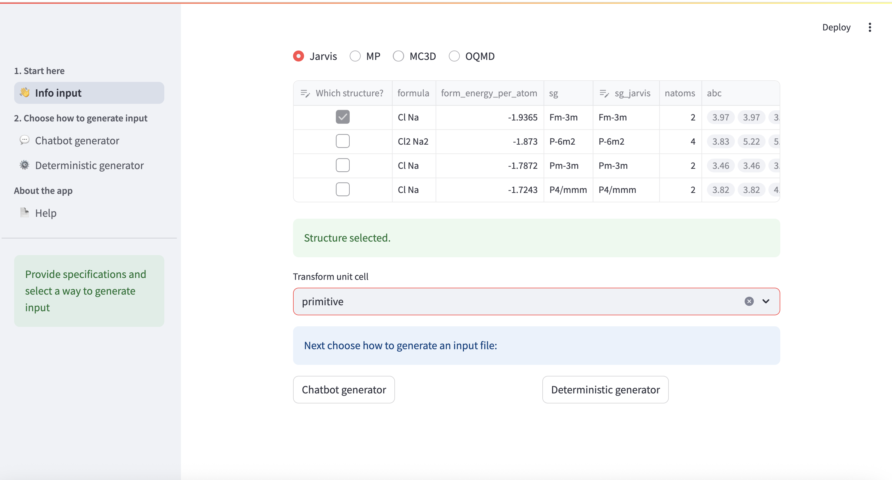

To generate an input file you need to specify some information first. Below the data input page is shown.

The default parameters are shown in grey. You need to choose the xc-functional (PBE or PBESol), the pseudopotential flavour (efficiency or precision) and ML model predicting k-mesh. In this application we use SSSP library of pseudopotentials, so options are limited by this choice. 

Structure should be provided via file upload ('.cif' format) or fetched from one of the free materials databases. Materials Project database requires registration to get a personal API key.

When all required information is provided at the bottom of the page two buttons 'Chatbot generator' and 'Deterministic generator' appear.